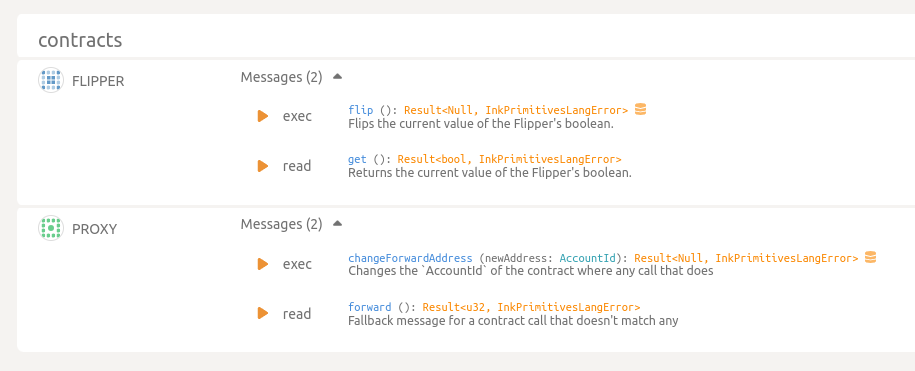
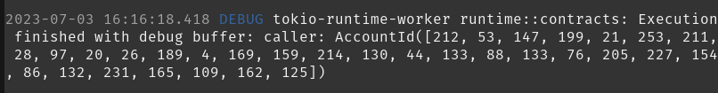
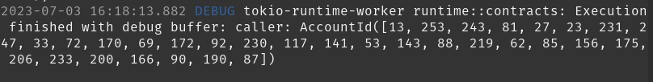

To reproduce caller bug:

0. added a print caller line to the `get()` fn of the flipper contract
   ```rust
        /// Returns the current value of the Flipper's boolean.
        #[ink(message)]
        pub fn get(&self) -> bool {
            ink::env::debug_println!("caller: {:?}", ink::env::caller::<ink::env::DefaultEnvironment>());
            self.value
        }
   ```
   This prints the address of the caller to the console of the substrate node.
1. build the flipper contract: `cd flipper && cargo contract build`
1. deploy the flipper contract: `cd flipper && cargo contract instantiate --suri //Alice --constructor new_default` 

   

1. build the proxy contract: `cd upgradeable-contracts/forward-calls && cargo contract build`
1. deploy the proxy contract: `cd upgradeable-contracts/forward-calls && cargo contract instantiate --suri //Alice --args <address of the flipper contract>`

   

1. here's what the deployment looks like in polkadot js apps:
   
1. call the `get()` fn in the flipper contract: `cd flipper && cargo contract call --contract <address of the flipper contract> --suri //Alice --message get` 
    `[212, 53, ...] == 5GrwvaEF5zXb26Fz9rcQpDWS57CtERHpNehXCPcNoHGKutQY` which is Alice's account
1. call the `get()` fn in the proxy contract: `cd flipper && cargo contract call --contract <address of the proxy contract> --suri //Alice --message get` 
    `[13, 253, ...] == 5CP3vEmx4SnpTHBt8Tx1o3guQjyyqLLRVdY8C8yqGgVaELja` which is the proxy contract's account (for my deployment at least, your's will be different). **This should be Alice's account, not the proxy account.**